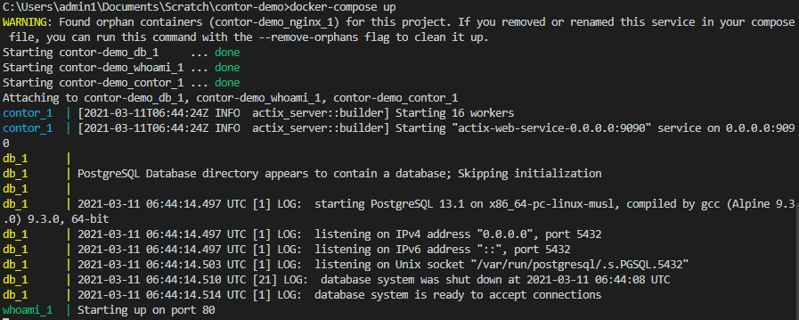
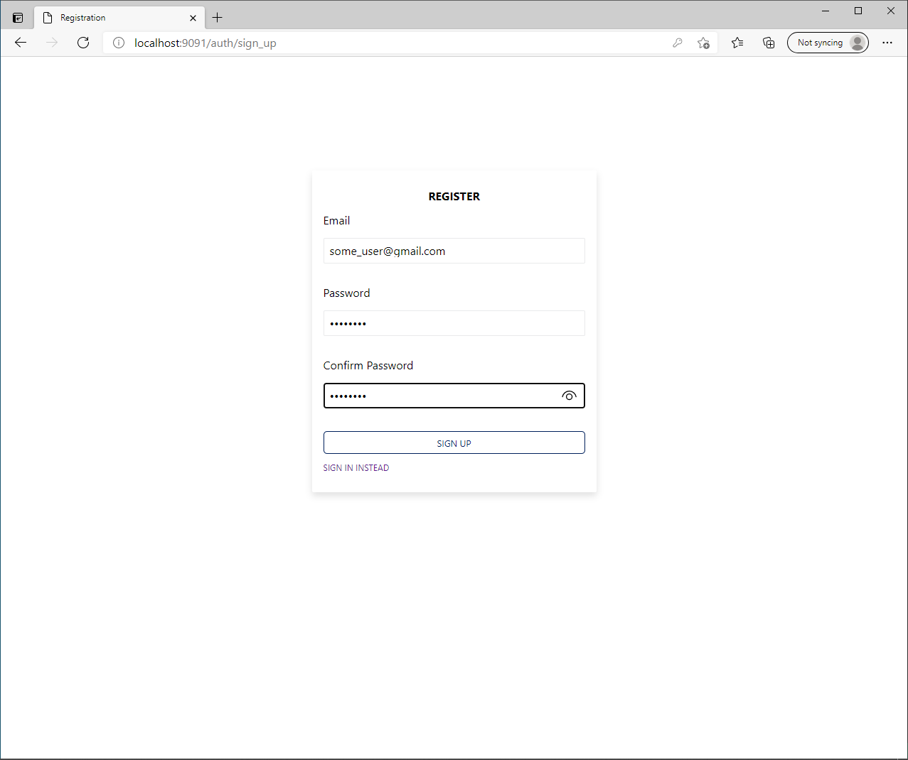
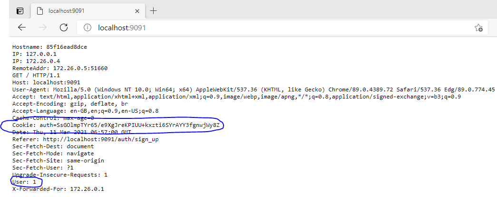

[](https://hub.docker.com/u/authnproxy)
[](https://hub.docker.com/u/authnproxy)

**Barricade** is a docker container that implements logon and registration forms for your application. It's aim is to implement all authentication best practices with minimal integration.

## Features 

* A "No Code" solution. Zero integration.
* Reduces the number of dependencies for your main application reducing he risk of supply chain attacks. 
* Data in your region in your database and under your control.
* Small high performance Docker container built with Rust.
* Configure with environment variables.
* Works well as a Kubernetes side car.
* Works with [Envoy Proxy](https://www.envoyproxy.io/) as an [External Authorization](https://www.envoyproxy.io/docs/envoy/latest/api-v3/extensions/filters/http/ext_authz/v3/ext_authz.proto). 
* Encrypted Mode - Generates ECDH and ECDSA keys client side. Uses a similar technique to Bitwarden but upgraded.
* Session state is stored client side in secure HTTP only cookies which are not accessible by JavaScript.
* Client side session state is encrypted with AES-GCM and additional data.
* Can replace rails devise or other popular open source auth libraries.
* NKFC password normalisation.
* TODO - WebAuthn for 2FA
* TODO - Allow user to see sessions and logout devices.

## Barricade defends against the following attacks

* Account enumeration 
* Password stuffing
* Password Brute forcing
* Session Hijacking
* Data breach password brute forcing.

## Configuration Environment Variables

| Name  | Type | Description |
| ---- | ---- | ---- |
| DATABASE_URL | Mandatory | URL of the Postgres database |
| SECRET_KEY | Mandatory | 256 bits of entropy in hex. Used to encrypt the cookie. You can use `openssl rand -hex 32` |
| REDIRECT_URL | Mandatory | After login or registration redirect the user to this URL |
| SECURE_COOKIE | Optional | If present set the authentication cookie to secure. |
| PORT | Optional | The port to listen on, defaults to 9090 |
| USER_TABLE_NAME | Optional | Set this to the table name of your users table. Defaults to `users` |
| ENABLE_EMAIL_OTP | Optional | If enabled every logon and registration requires email confirmation |
| SMTP_HOST | Optional | The hostname of your email provider |
| SMTP_USERNAME | Mandatory when using SMTP | The hostname of your username provider |
| SMTP_PASSWORD | Mandatory when using SMTP | The hostname of your password provider |
| SMTP_PORT | Mandatory when using SMTP | The SMTP port of your email provider |
| SMTP_TLS_OFF | Optional | Switch off SMTP TLS useful for local devlopment |
| RESET_DOMAIN | Mandatory when using SMTP | For a password reset email set your domain |
| RESET_FROM_EMAIL_ADDRESS | Mandatory when using SMTP | For a password reset email set your from email address |

## Proxy Mode

If enabled all traffic that is not `/auth*` will be passed through to the app listinging on `FORWARD_URL:FORWARD_PORT`.

| Name  | Type | Description |
| ---- | ---- | ---- |
| FORWARD_URL | Mandatory | The host to proxy |
| FORWARD_PORT | Mandatory | The port of the host to proxy |
| SKIP_AUTH_FOR | Mandatory | Comma separated list of paths that are not to be authenticated |
| MAX_PAYLOAD_SIZE | Optional | The maximum data size of a request we will proxy |

## Hcaptcha

If enabled [Invisible hCaptcha](https://docs.hcaptcha.com/invisible/) will be used on all form submit buttons. This should provide protect against bot attacks and mitigate password stuffing, account enumeration as well as brute force attacks.

| Name  | Type | Description |
| ---- | ---- | ---- |
| HCAPTCHA_SITE_KEY | Optional | hCaptcha site key |
| HCAPTCHA_SECRET_KEY | Mandatory if site ket is set | hCaptcha secret key |

## Try it out 

To show how quickly you can get going with Authn Proxy let's add authentication to a small web app called [Whoami](https://hub.docker.com/r/containous/whoami). Whoami is a tiny Go webserver that prints os information and HTTP request to output and is avaible on docker hub. 

To get started cut and paste the following definition into a file called `docker-compose.yml` 

```yaml
version: '3.4'
services:

  # First let's create a postgres database
  db:
    image: postgres:alpine
    environment:
      POSTGRES_PASSWORD: testpassword
      POSTGRES_USER: postgres
    healthcheck:
      test: ["CMD-SHELL", "pg_isready -U postgres"]
      interval: 10s
      timeout: 5s
      retries: 5

  # As an example we'll add login/registration to 
  # https://hub.docker.com/r/containous/whoami
  whoami:
    image: containous/whoami

  # Configure Authn Proxy to listen on port 9090 and reverse proxy nginx on port 80.
  authn:
    image: authnproxy/authnproxy
    environment:
        # This secret key is used to encrypt cookies.
        SECRET_KEY: 190a5bf4b3cbb6c0991967ab1c48ab30790af876720f1835cbbf3820f4f5d949
        DATABASE_URL: postgresql://postgres:testpassword@db:5432
        FORWARD_URL: whoami
        FORWARD_PORT: 80
        # Any requests that meet the following regulkar expressions
        # with pass through. i.e. They don't require auth.
        SKIP_AUTH_FOR: /api*
        REDIRECT_URL: '/'
    ports:
      - "9091:9090"
    depends_on:
      db:
        condition: service_healthy
```

## Bring up the services

```console
docker-compose up
```

And you should get output on your console like the following.

<p align="center">
  
</p>

## Intercept user requests

If you now head to `http://localhost:9091/api` in your browser you should see the following output from Whoami.

<p align="center">
  
</p>

        
We set our environment variable `SKIP_AUTH_FOR` to `/api*` which means we allow people to access the `/api` end point without being authenticated.

## Access an endpoint that requires authentication.


Access `localhost:9091` and you'll see Authn Proxy block your request.

<p align="center">
  
</p>

## Add a user table

We need to add a user table to our database. Run the psql command line from docker-compose

```console
docker-compose run db psql postgres://postgres:testpassword@db:5432
```

Once you have the psql command prompt you can cut and paste the following code to create a users and sessions table.

```sql

CREATE TABLE users (
    id SERIAL PRIMARY KEY, 
    email VARCHAR NOT NULL UNIQUE, 
    hashed_password VARCHAR NOT NULL, 
    reset_password_token UUID,
    reset_password_sent_at TIMESTAMP,
    created_at TIMESTAMP NOT NULL DEFAULT NOW(),
    updated_at TIMESTAMP NOT NULL DEFAULT NOW()
);

CREATE TABLE sessions (
    id SERIAL PRIMARY KEY, 
    session_verifier VARCHAR NOT NULL, 
    user_id INT NOT NULL, 
    otp_code_encrypted VARCHAR NOT NULL,
    otp_code_attempts INTEGER NOT NULL DEFAULT 0,
    otp_code_confirmed BOOLEAN NOT NULL DEFAULT false,
    otp_code_sent BOOLEAN NOT NULL DEFAULT false,
    created_at TIMESTAMP NOT NULL DEFAULT NOW(),

    CONSTRAINT fk_user
        FOREIGN KEY(user_id) 
        REFERENCES users(id)
);
```

<p align="center">
  
</p>

## Register a new user

Go to `localhost:9091/auth/sign_up` in your browser and register.

<p align="center">
  
</p>

After registration you'll be take to the whoami home page as we set `REDIRECT_URL` to `/`.

You'll then be greated with 


<p align="center">
  
</p>

There's two important things to note from the whoami screenshot.

* The Cookie header `session=` is stored client side and is an encrypted cookie based on `SECRET_KEY`
* A header called `x-user-id` is passed in. This is the primary key of the user in the Users table. Your app can retrieve this header to access the logged in user. This is not stored on the client it's only passed from Authn Proxy to your application.

## Finally take a look in the database

Run the following command in the psql shell to see the your new user registration in the database.

```console
docker-compose run db psql postgres://postgres:testpassword@db:5432
```


```console
psql=# select id, email, hashed_password from users;
 id |        email         |                                         hashed_password                                          |
----+----------------------+--------------------------------------------------------------------------------------------------+
  6 | some_user@gmail.com  | $argon2id$v=19$m=4096,t=3,p=1$kf7KkCPIIfbl1dgasa58yQ$WFNVT05c2ptBtBAZQI1CIGaEqbR9m3505WiZ+/oflk0 |
(1 row)
```

This is how your user table looks after a user registration.
